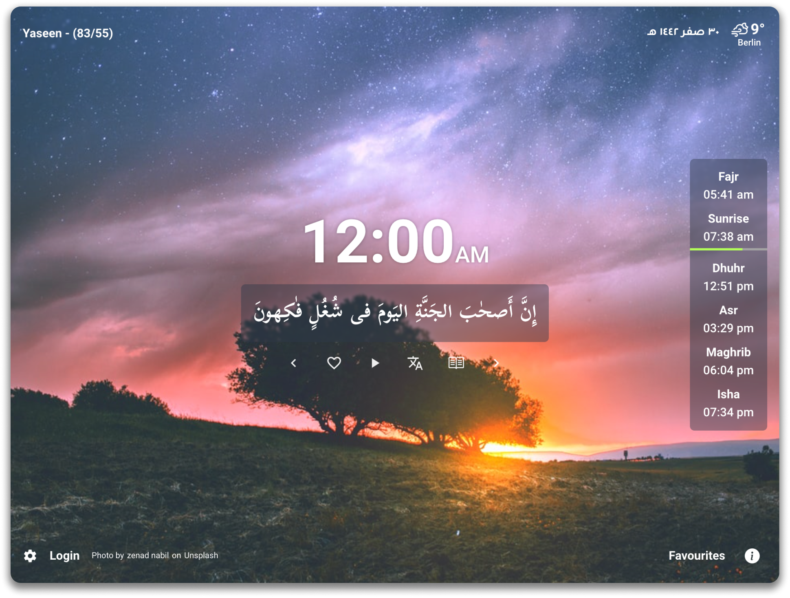
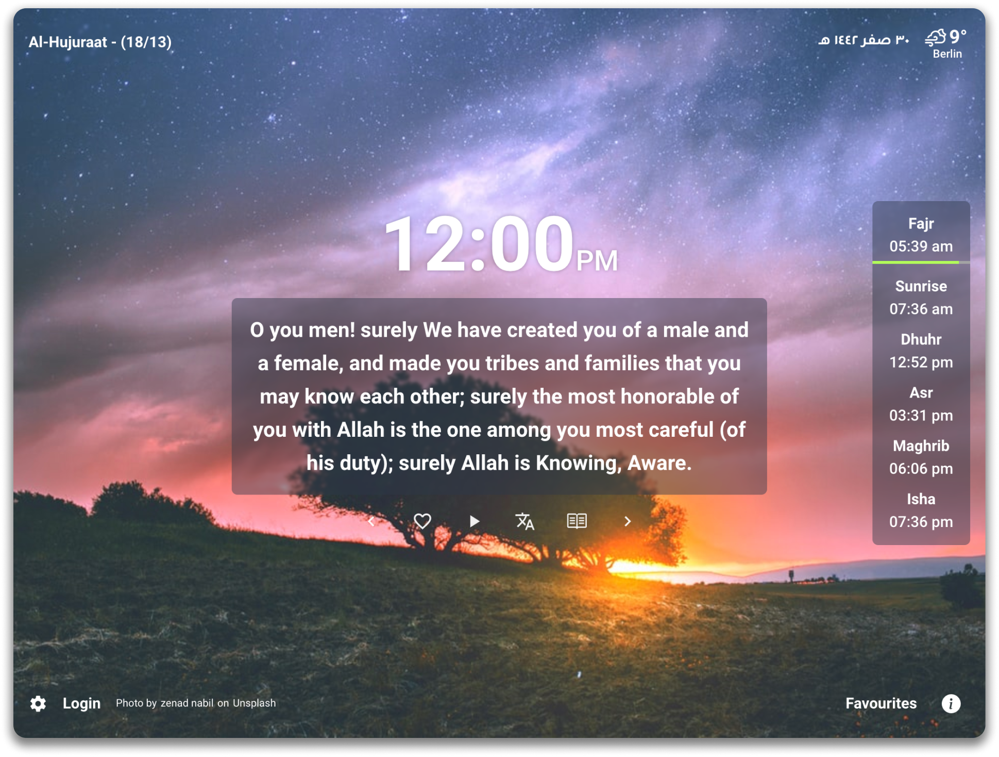
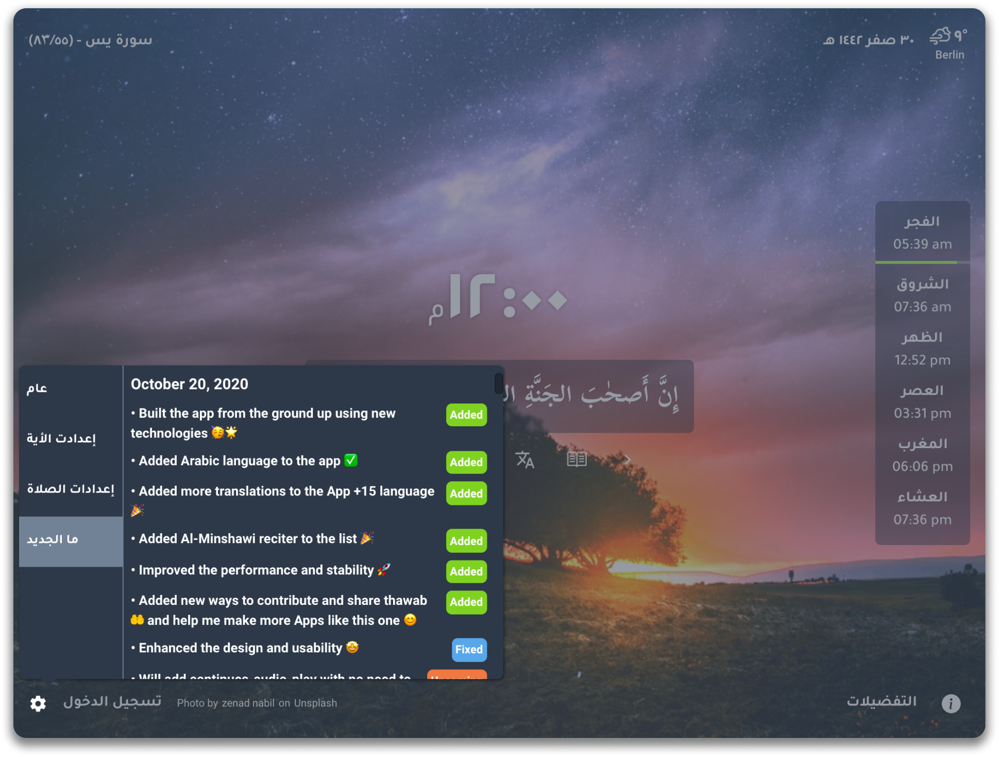

# Quran Tab Landing Page

## [🌟Live Website🌟](https://quran-tab-landing-page.netlify.app)

## [Live Link](https://quran-tab-landing-page.netlify.app)

## Description
Quran Tab is a Chrome extension that replaces your new tab with a random ayah from the Quran. It aims to keep users inspired by presenting a verse from the Quran every time they open a new tab. This landing page provides information about the extension, its features, and how to download it.

## Skills Learned
This project involved the application of various skills, including:
- **HTML:** Used to structure the content and create the layout of the landing page.
- **CSS:** Implemented for styling, layout enhancements, and design consistency.
- **SASS:** Utilized to streamline and enhance the CSS styling process.
- **Animation:** Implemented subtle animations for a more engaging user interface.
- **Responsive Design:** Ensured a seamless user experience across various devices and screen sizes.

## Landing Page Overview

## How to Use
1. Clone the repository: `git clone https://github.com/MMansy19/quran-tab-landing-page.git`
2. Open the `index.html` file in a web browser to view the landing page.

## License
This project is licensed under the MIT License - see the [LICENSE](LICENSE) file for details.

## Contact

- [Author](https://github.com/MMansy19)
- [Website](https://mahmoud-mansy-portfolio.netlify.app/)
- [Email](mailto:mahmoud2abdalfattah@gmail.com)
- [LinkedIn](https://www.linkedin.com/in/mahmoud-mansy-a189a5232)
