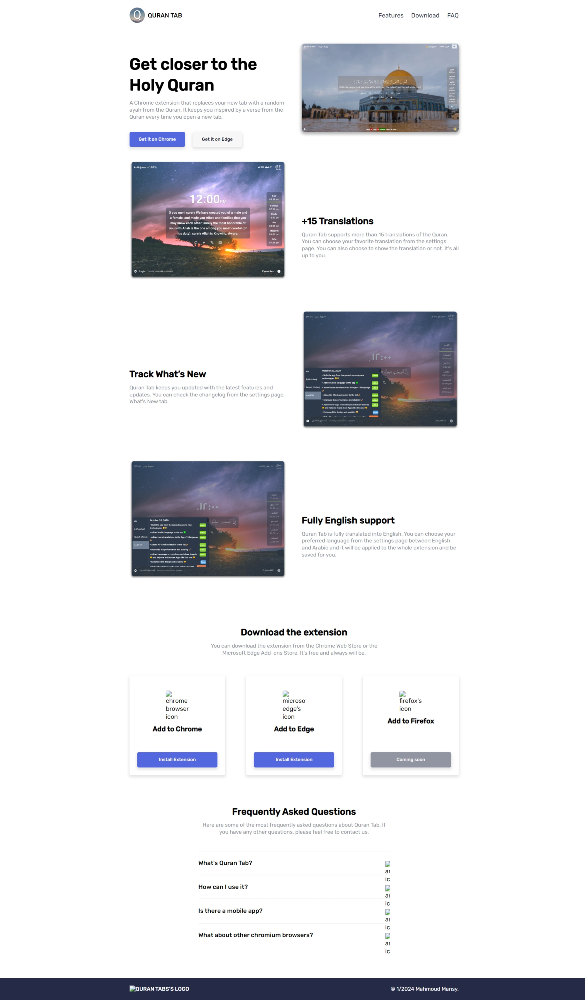

# Quran Tab Landing Page

## Description
Quran Tab is a Chrome extension that replaces your new tab with a random ayah from the Quran. It aims to keep users inspired by presenting a verse from the Quran every time they open a new tab. This landing page provides information about the extension, its features, and how to download it.

## Skills Learned
This project involved the application of various skills, including:
- **HTML:** Used to structure the content and create the layout of the landing page.
- **CSS:** Implemented for styling, layout enhancements, and design consistency.
- **SASS:** Utilized to streamline and enhance the CSS styling process.
- **Responsive Design:** Ensured a seamless user experience across various devices and screen sizes.
- **Animation:** Implemented subtle animations for a more engaging user interface.

## Live Website
Check out the live Quran Tab landing page: [Quran Tab](https://your-live-website-url.com)

## Contact Information
Feel free to reach out for any inquiries or feedback:
- **Author:** Mahmoud Mansy
- **Email:** [your.email@example.com](mailto:your.email@example.com)

## How to Use
1. Clone the repository: `git clone https://github.com/your-username/quran-tab-landing-page.git`
2. Open the `index.html` file in a web browser to view the landing page.

## Screenshots and Images

### Landing Page Overview

### Features Section

### Download Section

### FAQ Section

### Footer

## Acknowledgments
Special thanks to Eng. Mohamed and Ahmed Fathy for their guidance and mentorship throughout my learning journey. Additionally, gratitude to Almadrsa.com for providing an exceptional learning platform.

## License
This project is licensed under the MIT License - see the [LICENSE](LICENSE) file for details.

---
**Note:** Replace placeholders such as "your-live-website-url.com," "your.email@example.com," and image paths with the actual live website URL, your contact email address, and the correct image paths or URLs. Add more images as needed to showcase different sections of your landing page.
